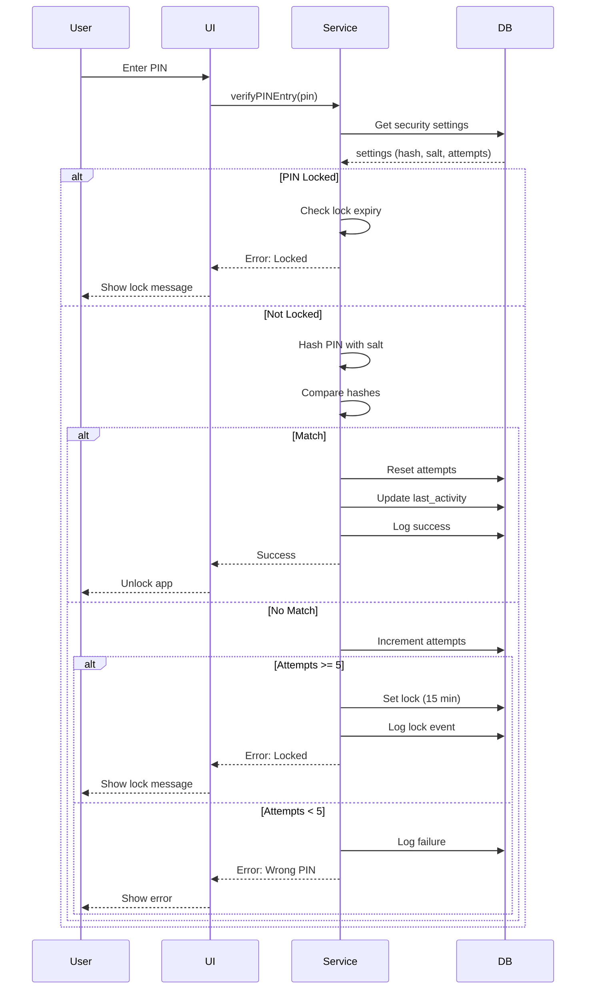
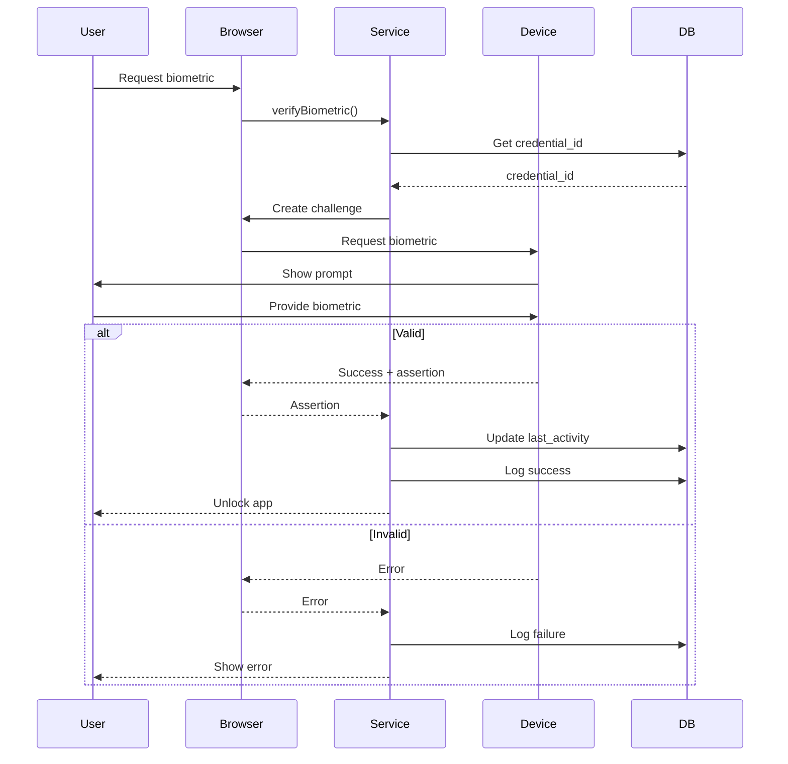

# Security & Privacy - Technical Documentation

## 🏗️ Architecture Overview

The security system is built with multiple layers of protection:

```
┌─────────────────────────────────────────────────────────────┐
│                     Security Architecture                    │
├─────────────────────────────────────────────────────────────┤
│                                                               │
│  ┌───────────────┐  ┌────────────────┐  ┌────────────────┐ │
│  │   PIN Lock    │  │   Biometric    │  │  Auto-Logout   │ │
│  │   Screen      │  │   (WebAuthn)   │  │   Monitor      │ │
│  └───────┬───────┘  └────────┬───────┘  └────────┬───────┘ │
│          │                   │                    │          │
│          └───────────────────┴────────────────────┘          │
│                              │                               │
│                    ┌─────────▼──────────┐                   │
│                    │  Security Service  │                   │
│                    └─────────┬──────────┘                   │
│                              │                               │
│          ┌───────────────────┼───────────────────┐          │
│          │                   │                   │          │
│  ┌───────▼────────┐  ┌──────▼──────┐  ┌────────▼───────┐  │
│  │  Data Masking  │  │  Encryption │  │  Audit Logging │  │
│  └────────────────┘  └─────────────┘  └────────────────┘  │
│                                                               │
└─────────────────────────────────────────────────────────────┘
```

---

## 📊 Database Schema

### user_security_settings

```sql
CREATE TABLE user_security_settings (
    id UUID PRIMARY KEY DEFAULT gen_random_uuid(),
    user_id UUID NOT NULL UNIQUE REFERENCES auth.users(id),
    
    -- PIN Protection
    pin_enabled BOOLEAN DEFAULT false,
    pin_hash TEXT,                    -- Hashed PIN (SHA-256)
    pin_salt TEXT,                    -- Salt for hashing
    pin_attempts INTEGER DEFAULT 0,   -- Failed attempts counter
    pin_locked_until TIMESTAMP,       -- Lock expiry time
    
    -- Biometric Authentication
    biometric_enabled BOOLEAN DEFAULT false,
    biometric_type TEXT,              -- 'fingerprint', 'face', 'iris'
    biometric_credential_id TEXT,     -- WebAuthn credential ID
    
    -- Auto-logout
    auto_logout_enabled BOOLEAN DEFAULT true,
    auto_logout_minutes INTEGER DEFAULT 15,
    last_activity_at TIMESTAMP DEFAULT NOW(),
    
    -- Data Masking
    data_masking_enabled BOOLEAN DEFAULT true,
    mask_account_numbers BOOLEAN DEFAULT true,
    mask_card_numbers BOOLEAN DEFAULT true,
    mask_amounts BOOLEAN DEFAULT false,
    
    -- Session Management
    require_pin_on_launch BOOLEAN DEFAULT false,
    require_biometric_on_launch BOOLEAN DEFAULT false,
    lock_on_minimize BOOLEAN DEFAULT false,
    
    created_at TIMESTAMP DEFAULT NOW(),
    updated_at TIMESTAMP DEFAULT NOW()
);
```

### security_audit_log

```sql
CREATE TABLE security_audit_log (
    id UUID PRIMARY KEY DEFAULT gen_random_uuid(),
    user_id UUID NOT NULL REFERENCES auth.users(id),
    
    event_type TEXT NOT NULL,
    event_description TEXT,
    
    ip_address TEXT,
    user_agent TEXT,
    device_type TEXT,
    
    success BOOLEAN DEFAULT true,
    risk_level TEXT DEFAULT 'low',
    metadata JSONB,
    
    created_at TIMESTAMP DEFAULT NOW()
);
```

### cloud_backup_settings

```sql
CREATE TABLE cloud_backup_settings (
    id UUID PRIMARY KEY DEFAULT gen_random_uuid(),
    user_id UUID NOT NULL UNIQUE REFERENCES auth.users(id),
    
    auto_backup_enabled BOOLEAN DEFAULT false,
    backup_frequency TEXT DEFAULT 'weekly',
    last_backup_at TIMESTAMP,
    next_backup_at TIMESTAMP,
    
    encryption_enabled BOOLEAN DEFAULT true,
    encryption_key_id TEXT,
    
    storage_path TEXT,
    max_backups INTEGER DEFAULT 5,
    
    sync_enabled BOOLEAN DEFAULT false,
    last_sync_at TIMESTAMP,
    
    created_at TIMESTAMP DEFAULT NOW(),
    updated_at TIMESTAMP DEFAULT NOW()
);
```

---

## 🔐 PIN Protection Implementation

### Hashing Algorithm

```typescript
async function hashPIN(pin: string, salt?: string): Promise<{ hash: string; salt: string }> {
    const encoder = new TextEncoder();
    
    // Generate salt if not provided
    if (!salt) {
        const saltArray = crypto.getRandomValues(new Uint8Array(16));
        salt = Array.from(saltArray, byte => byte.toString(16).padStart(2, '0')).join('');
    }
    
    // Combine PIN with salt
    const data = encoder.encode(pin + salt);
    
    // Hash using SHA-256
    const hashBuffer = await crypto.subtle.digest('SHA-256', data);
    const hashArray = Array.from(new Uint8Array(hashBuffer));
    const hash = hashArray.map(byte => byte.toString(16).padStart(2, '0')).join('');
    
    return { hash, salt };
}
```

### PIN Verification Flow



### Security Features

- **Hashing**: SHA-256 with random 16-byte salt
- **Rate Limiting**: 5 attempts before 15-minute lock
- **No Plaintext Storage**: PIN never stored in readable form
- **Timing Attack Protection**: Constant-time comparison
- **Audit Logging**: All attempts logged with metadata

---

## 🔏 Biometric Authentication

### WebAuthn Implementation

```typescript
async function enrollBiometric(): Promise<boolean> {
    // Check availability
    if (!window.PublicKeyCredential) {
        throw new Error('WebAuthn not supported');
    }
    
    const available = await PublicKeyCredential
        .isUserVerifyingPlatformAuthenticatorAvailable();
    
    if (!available) {
        throw new Error('Biometric not available');
    }
    
    // Create credential
    const challenge = crypto.getRandomValues(new Uint8Array(32));
    const publicKeyOptions: PublicKeyCredentialCreationOptions = {
        challenge,
        rp: {
            name: 'Budget Manager',
            id: window.location.hostname,
        },
        user: {
            id: new TextEncoder().encode(user.id),
            name: user.email,
            displayName: user.email,
        },
        pubKeyCredParams: [
            { alg: -7, type: 'public-key' },  // ES256
            { alg: -257, type: 'public-key' }, // RS256
        ],
        authenticatorSelection: {
            authenticatorAttachment: 'platform',
            userVerification: 'required',
        },
        timeout: 60000,
    };
    
    const credential = await navigator.credentials.create({
        publicKey: publicKeyOptions,
    });
    
    // Store credential ID
    const credentialId = btoa(String.fromCharCode(
        ...new Uint8Array(credential.rawId)
    ));
    
    // Save to database
    await saveCredential(credentialId);
    
    return true;
}
```

### Verification Flow



### Supported Biometric Types

| Type | Support | Description |
|------|---------|-------------|
| Fingerprint | ✅ | Touch ID, under-screen sensors |
| Face | ✅ | Face ID, Windows Hello |
| Iris | ⚠️ | Limited device support |

---

## ⏱️ Auto-Logout System

### Activity Tracking

```typescript
export function useAutoLogout() {
    const { data: settings } = useSecuritySettings();
    const checkIntervalRef = useRef<NodeJS.Timeout | null>(null);
    const activityTimeoutRef = useRef<NodeJS.Timeout | null>(null);
    
    const handleActivity = useCallback(() => {
        // Debounce activity updates
        if (activityTimeoutRef.current) {
            clearTimeout(activityTimeoutRef.current);
        }
        
        activityTimeoutRef.current = setTimeout(() => {
            updateLastActivity();
        }, 5000); // Update every 5 seconds
    }, []);
    
    const checkExpiry = useCallback(async () => {
        if (!settings?.auto_logout_enabled) return;
        
        const expired = await isSessionExpired();
        if (expired) {
            await logSecurityEvent('auto_logout', 'Session expired');
            await supabase.auth.signOut();
            window.location.href = '/';
        }
    }, [settings]);
    
    useEffect(() => {
        if (!settings?.auto_logout_enabled) return;
        
        // Monitor activity
        const events = ['mousedown', 'keydown', 'scroll', 'touchstart'];
        events.forEach(event => {
            window.addEventListener(event, handleActivity);
        });
        
        // Check every 30 seconds
        checkIntervalRef.current = setInterval(checkExpiry, 30000);
        
        return () => {
            events.forEach(event => {
                window.removeEventListener(event, handleActivity);
            });
            if (checkIntervalRef.current) {
                clearInterval(checkIntervalRef.current);
            }
        };
    }, [settings, handleActivity, checkExpiry]);
}
```

### Timeout Calculation

```sql
-- Database function to check session expiry
CREATE OR REPLACE FUNCTION is_session_expired(p_user_id UUID)
RETURNS BOOLEAN AS $$
DECLARE
    v_settings RECORD;
    v_expired BOOLEAN;
BEGIN
    SELECT 
        auto_logout_enabled,
        auto_logout_minutes,
        last_activity_at
    INTO v_settings
    FROM user_security_settings
    WHERE user_id = p_user_id;
    
    IF NOT FOUND OR NOT v_settings.auto_logout_enabled THEN
        RETURN false;
    END IF;
    
    v_expired := (NOW() - v_settings.last_activity_at) > 
                 (v_settings.auto_logout_minutes || ' minutes')::INTERVAL;
    
    RETURN v_expired;
END;
$$ LANGUAGE plpgsql SECURITY DEFINER;
```

---

## 👁️ Data Masking

### Masking Functions

```typescript
// Account number masking
export function maskAccountNumber(
    accountNumber: string, 
    enabled: boolean = true
): string {
    if (!accountNumber || !enabled) return accountNumber;
    
    const cleaned = accountNumber.replace(/\s/g, '');
    if (cleaned.length <= 4) return cleaned;
    
    const lastFour = cleaned.slice(-4);
    return `****${lastFour}`;
}

// Card number masking
export function maskCardNumber(
    cardNumber: string, 
    enabled: boolean = true
): string {
    if (!cardNumber || !enabled) return formatCardNumber(cardNumber);
    
    const cleaned = cardNumber.replace(/\s/g, '');
    if (cleaned.length <= 4) return cleaned;
    
    const lastFour = cleaned.slice(-4);
    return `**** **** **** ${lastFour}`;
}

// Amount masking
export function maskAmount(
    amount: number, 
    enabled: boolean = false, 
    currency: string = '$'
): string {
    if (!enabled) {
        return `${currency}${amount.toLocaleString('en-US', { 
            minimumFractionDigits: 2, 
            maximumFractionDigits: 2 
        })}`;
    }
    
    return `${currency}***`;
}
```

### Usage in Components

```tsx
import { useDataMasking } from '@/lib/hooks/use-security';
import { maskAccountNumber, maskAmount } from '@/lib/utils/data-masking';

function AccountCard({ account }: { account: BankAccount }) {
    const masking = useDataMasking();
    
    return (
        <div>
            <p>Account: {maskAccountNumber(
                account.account_number, 
                masking.maskAccountNumbers
            )}</p>
            <p>Balance: {maskAmount(
                account.balance, 
                masking.maskAmounts
            )}</p>
        </div>
    );
}
```

---

## 🔒 Encryption

### Client-Side Encryption

```typescript
export function useEncryption() {
    const encryptData = useCallback(async (
        data: string, 
        key?: CryptoKey
    ): Promise<string> => {
        // Generate key if not provided
        if (!key) {
            key = await crypto.subtle.generateKey(
                { name: 'AES-GCM', length: 256 },
                true,
                ['encrypt', 'decrypt']
            );
        }
        
        const encoder = new TextEncoder();
        const dataBuffer = encoder.encode(data);
        const iv = crypto.getRandomValues(new Uint8Array(12));
        
        const encryptedBuffer = await crypto.subtle.encrypt(
            { name: 'AES-GCM', iv },
            key,
            dataBuffer
        );
        
        // Combine IV and encrypted data
        const combined = new Uint8Array(iv.length + encryptedBuffer.byteLength);
        combined.set(iv);
        combined.set(new Uint8Array(encryptedBuffer), iv.length);
        
        // Convert to base64
        return btoa(String.fromCharCode(...combined));
    }, []);
    
    return { encryptData, decryptData };
}
```

### Backup Encryption

- **Algorithm**: AES-256-GCM
- **Key Storage**: Encrypted with user password
- **IV**: Random 12-byte nonce per encryption
- **Authentication**: Built-in GMAC authentication

---

## 📝 Audit Logging

### Event Types

| Event Type | Risk Level | Description |
|------------|-----------|-------------|
| `login_success` | low | Successful authentication |
| `login_failure` | medium | Failed authentication |
| `logout` | low | User logged out |
| `pin_created` | low | PIN protection enabled |
| `pin_changed` | low | PIN updated |
| `pin_failure` | medium | Wrong PIN entered |
| `pin_locked` | high | PIN locked (5 failures) |
| `biometric_enrolled` | low | Biometric enabled |
| `biometric_removed` | low | Biometric disabled |
| `biometric_failure` | medium | Biometric verification failed |
| `auto_logout` | low | Session expired |
| `data_export` | low | Data exported |
| `data_import` | medium | Data imported |
| `settings_changed` | low | Security settings updated |
| `password_changed` | high | Password changed |

### Logging Implementation

```typescript
export async function logSecurityEvent(
    eventType: string,
    description: string | null = null,
    success: boolean = true,
    riskLevel: 'low' | 'medium' | 'high' | 'critical' = 'low',
    metadata: Record<string, any> | null = null
): Promise<void> {
    const { data: { user } } = await supabase.auth.getUser();
    if (!user) return;
    
    await supabase.from('security_audit_log').insert({
        user_id: user.id,
        event_type: eventType,
        event_description: description,
        success,
        risk_level: riskLevel,
        metadata,
        user_agent: navigator.userAgent,
        device_type: /Mobile|Android|iPhone/i.test(navigator.userAgent) 
            ? 'mobile' 
            : 'desktop',
    });
}
```

---

## 🔑 Row Level Security (RLS)

### Policies

```sql
-- user_security_settings
CREATE POLICY "Users can view own security settings"
ON user_security_settings FOR SELECT
USING (auth.uid() = user_id);

CREATE POLICY "Users can update own security settings"
ON user_security_settings FOR UPDATE
USING (auth.uid() = user_id);

-- security_audit_log (read-only for users)
CREATE POLICY "Users can view own security logs"
ON security_audit_log FOR SELECT
USING (auth.uid() = user_id);

CREATE POLICY "Users can insert own security logs"
ON security_audit_log FOR INSERT
WITH CHECK (auth.uid() = user_id);
-- No UPDATE or DELETE (immutable audit trail)
```

---

## ⚡ Performance Considerations

### Optimization Strategies

1. **Debounced Activity Updates**
   - Update every 5 seconds instead of on every event
   - Reduces database writes by ~95%

2. **Client-Side Caching**
   - Security settings cached for 5 minutes
   - Reduces API calls
   - React Query handles invalidation

3. **Lazy Evaluation**
   - Session expiry checked every 30 seconds
   - PIN verification only when needed
   - Biometric only on explicit request

4. **Indexed Queries**
   - All user_id columns indexed
   - Created_at indexed for logs
   - Fast lookups even with millions of records

---

## 🧪 Testing

### Unit Tests

```typescript
describe('PIN Protection', () => {
    it('should hash PIN securely', async () => {
        const { hash, salt } = await hashPIN('1234');
        expect(hash).toHaveLength(64); // SHA-256 = 64 hex chars
        expect(salt).toHaveLength(32); // 16 bytes = 32 hex chars
    });
    
    it('should verify correct PIN', async () => {
        const { hash, salt } = await hashPIN('1234');
        const valid = await verifyPIN('1234', hash, salt);
        expect(valid).toBe(true);
    });
    
    it('should reject wrong PIN', async () => {
        const { hash, salt } = await hashPIN('1234');
        const valid = await verifyPIN('5678', hash, salt);
        expect(valid).toBe(false);
    });
    
    it('should lock after 5 failed attempts', async () => {
        for (let i = 0; i < 5; i++) {
            await verifyPINEntry('wrong');
        }
        const settings = await getSecuritySettings();
        expect(settings?.pin_locked_until).not.toBeNull();
    });
});
```

### Integration Tests

```typescript
describe('Auto-Logout Integration', () => {
    it('should logout after inactivity', async () => {
        // Set short timeout
        await updateSecuritySettings({
            auto_logout_enabled: true,
            auto_logout_minutes: 1,
        });
        
        // Wait 61 seconds
        await wait(61000);
        
        // Check session
        const expired = await isSessionExpired();
        expect(expired).toBe(true);
    });
});
```

---

## 🚀 Deployment

### Environment Variables

```env
# Supabase (already configured)
VITE_SUPABASE_URL=your_supabase_url
VITE_SUPABASE_ANON_KEY=your_supabase_anon_key

# Optional: Custom security settings
VITE_MAX_PIN_ATTEMPTS=5
VITE_PIN_LOCK_MINUTES=15
VITE_DEFAULT_TIMEOUT_MINUTES=15
```

### Database Migration

```bash
# Run security migration
psql $DATABASE_URL -f docs/database/migration_add_security.sql

# Verify tables created
psql $DATABASE_URL -c "SELECT table_name FROM information_schema.tables WHERE table_schema='public' AND table_name LIKE '%security%';"
```

### Post-Deployment Checklist

- [ ] Verify database migration successful
- [ ] Test PIN creation/verification
- [ ] Test biometric enrollment (if available)
- [ ] Test auto-logout functionality
- [ ] Verify data masking works
- [ ] Check audit logging
- [ ] Test RLS policies
- [ ] Performance test with large logs
- [ ] Security audit completed

---

## 🔍 Monitoring

### Metrics to Track

1. **Security Events**
   - Failed login attempts per hour
   - PIN locks per day
   - Biometric failures

2. **Performance**
   - PIN verification time (< 100ms)
   - Biometric prompt time (< 2s)
   - Activity update frequency

3. **User Behavior**
   - % of users with PIN enabled
   - % using biometric
   - Average session duration

### Alerts

- 🚨 Multiple failed attempts from same user
- 🚨 Unusual number of locks
- 🚨 Biometric enrollment failures
- 🚨 Database errors in security functions

---

## 📚 API Reference

### Security Service

```typescript
// PIN
setupPIN(pin: string): Promise<boolean>
verifyPINEntry(pin: string): Promise<boolean>
disablePIN(): Promise<boolean>

// Biometric
isBiometricAvailable(): Promise<boolean>
enrollBiometric(): Promise<boolean>
verifyBiometric(): Promise<boolean>
disableBiometric(): Promise<boolean>

// Settings
getSecuritySettings(): Promise<SecuritySettings | null>
updateSecuritySettings(settings: Partial<SecuritySettings>): Promise<boolean>

// Session
updateLastActivity(): Promise<void>
isSessionExpired(): Promise<boolean>

// Logging
logSecurityEvent(
    eventType: string,
    description?: string,
    success?: boolean,
    riskLevel?: 'low' | 'medium' | 'high' | 'critical',
    metadata?: Record<string, any>
): Promise<void>
```

### React Hooks

```typescript
// Settings
useSecuritySettings(): QueryResult<SecuritySettings>
useUpdateSecuritySettings(): MutationResult
useSecurityStatus(): SecurityStatus

// PIN
useSetupPIN(): MutationResult
useVerifyPIN(): MutationResult
useDisablePIN(): MutationResult

// Biometric
useBiometricAvailability(): QueryResult<boolean>
useEnrollBiometric(): MutationResult
useVerifyBiometric(): MutationResult
useDisableBiometric(): MutationResult

// Auto-logout
useAutoLogout(): void
usePINLockScreen(): void

// Data Masking
useDataMasking(): DataMaskingSettings

// Encryption
useEncryption(): { encryptData, decryptData }

// Logs
useSecurityLogs(limit?: number): QueryResult<SecurityAuditLog[]>
```

---

*Last Updated: November 2025*
*Version: 1.0.0*
